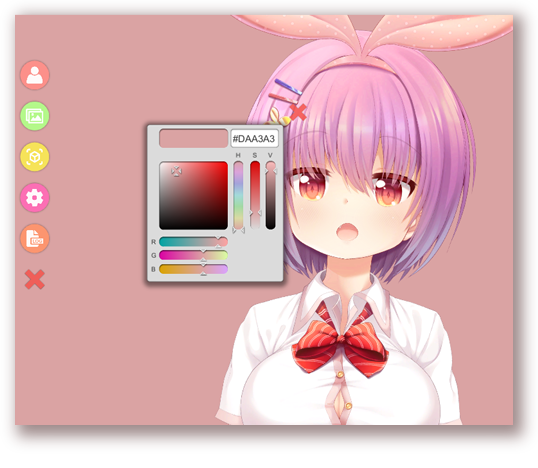

# How to load own backgrounds

[\[Back to main page\]](https://denchisoft.github.io/)

The app comes with some default backgrounds, some of them animated. The desktop-application also comes with a color-picker-background, pictured below.

__Supported formats:__
- PNG
- JPG
- .mp4
- .webm (on some platforms, may not be supported on mobile)

The backgrounds-folder can be found in the following locations. You may need to restart the app after adding your own backgrounds.

- **iPhone:** Open VTube Studio app data folder on your iPhone in iTunes (Windows or macOS) or Finder (on macOS Catalina). You'll find a Backgrounds-Folder.
- **Android:** \<Your Phone\>/Android/data/com.denchi.vtubestudio/files/Backgrounds
- **Mac:** VtubeStudio.app/Contents/Resources/Data/StreamingAssets/Backgrounds
- **Windows:** \<VTubeStudio.exe-Path\>/Vtube Studio_Data/StreamingAssets/Backgrounds

