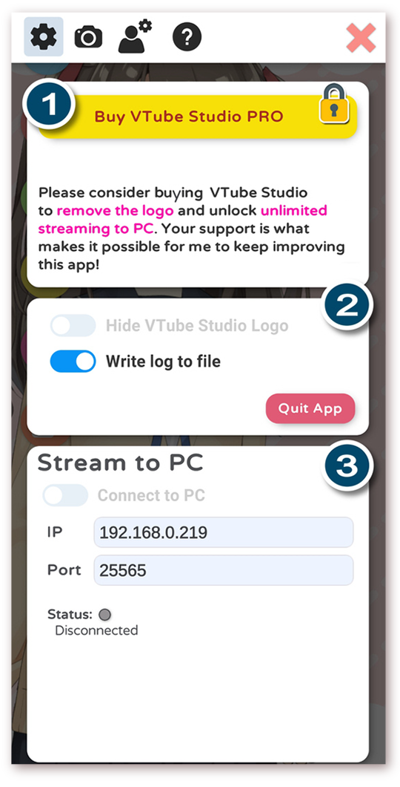
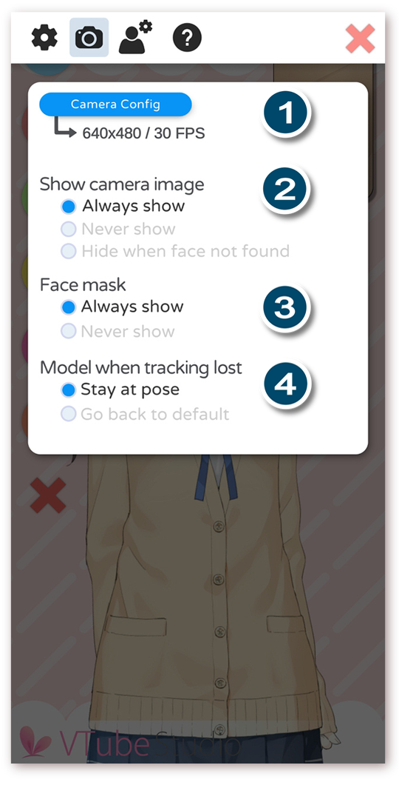

# VTube Studio Interface

[\[Back to main page\]](https://denchisoft.github.io/)

This page will go over the VTube Studio interface. The example used here is the mobile app, but this all applies to the desktop applications as well.

## Main Menu

1. Show/Hide camera (only available on mobile)
2. Show VTube Studio model selector
3. Show next background
4. Lock model position/rotation/scale
5. Open settings
6. Open/close log viewer

## Model selector

When opening the model selector, a bar showing all existing models will appear the the bottom of the screen.

## Face preview

After selecting a model, it will be shown on screen. You can move, rotate and scale it using normal smartphone controls.

When clicking the __"Show Camera"__ button, the camera preview window (1) will appear (smartphone only). On Android, this Window may be black if something went wrong with the ARCore setup. Check the log if that is the case.

__Click the camera preview window to calibrate the face tracking.__ While doing this, keep your face at a normal distance from the camera with a neutral expression on your face.

## Main Config

The settings screen appears when clicking the __Show Config__ button.

1. Button to buy a PRO subscription. This will allow you to stream to PC for an __unlimited time__ (normally limited to 1 minute in the free version) and removes the __Vtube Studio Logo__.
2. Some general configuration, including the button to quit the app.
3. Config for streaming to PC. After starting a VTube Studio server on your PC or Mac, you can put in the IP and port here and connect to it. When turning on "Auto-Conect to PC", the app will automatically try to connect in the background.

## Camera Config

Only available on smartphone.

1. The resolution used by ARCore. Some smartphones (including iPhone X) allow different resolutions and Frames-Per-Second settings to be selected there.
2. Whether or not you want to show the camera image in the app. If "Never show" is selected, the camera image will be set to black. If "Hide when face not found" is selected, the camera preview image will be set to black the moment face tracking is lost.
3. Face mask setting. If turned off, the face mask will not be shown over your face in the camera preview.

## Model Config (1, general info)

The general model setup. You can choose an icon and default idle animatio for your model that will control all Live2D parameters that are not controlled by your face tracking setup. Both the icon and idle animations have to be in the same folder as your Live2D model file.

You can use the __"Auto Setup"__ buttons to set up your currently loaded model for use on Android or iPhones. This will remove all VTS parameters and replace them with default ones based on the **default Live2D parameter names** you have used in your Live2D model.

## Model Config (2, parameter setup)

You can create VTube Stuio Model Parameters (__"VTS parameters"__). Those parameters connect the face tracking parameters (input) with the Live2D model parameters (output). You can 

## Test

...

