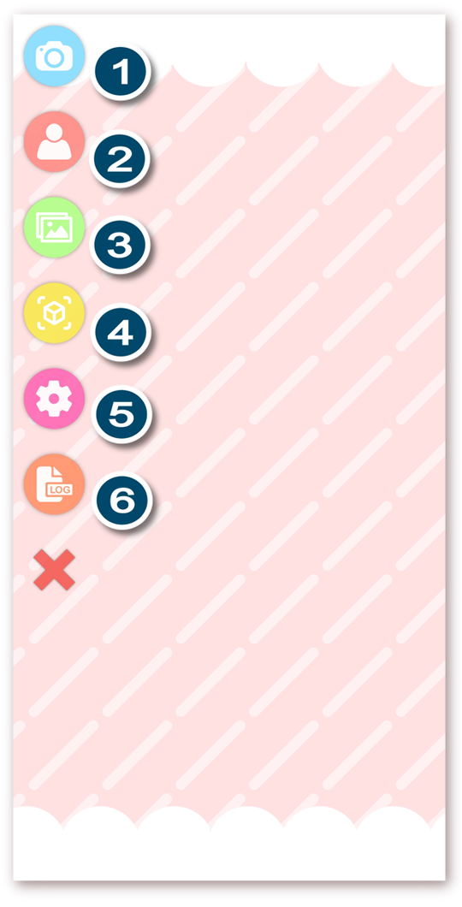

# VTube Studio Interface

[\[Back to main page\]](https://denchisoft.github.io/)

This page will go over the VTube Studio interface. The example used here is the mobile app, but this all applies to the desktop applications as well.

## Main Menu

1. Show/Hide camera (only available on mobile)
2. Show VTube Studio model selector
3. Show next background
4. Lock model position/rotation/scale
5. Open settings
6. Open/close log viewer

## Model selector

When opening the model selector, a bar showing all existing models will appear the the bottom of the screen.

## Face preview

After selecting a model, it will be shown on screen. You can move, rotate and scale it using normal smartphone controls.

When clicking the __"Show Camera"__ button, the camera preview window (1) will appear (smartphone only). On Android, this Window may be black if something went wrong with the ARCore setup. Check the log if that is the case.

