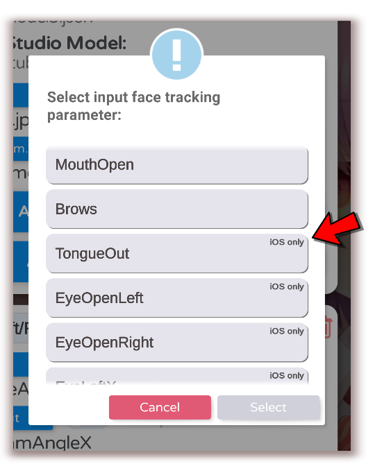

# iPhone vs. Android version

[\[Back to main page\]](https://denchisoft.github.io/)

The basic functionality of the iPhone and Android version is the same. Genereally, face tracking on iPhone is currently __faster__, __more accurate__ and __supports more face tracking parameters__. For example, iOS supports tracking opening and closing of eyes and sticking out your tongue.

As soon as this becomes viable on Android, the Android-version will be updated to support those parameters as well.

