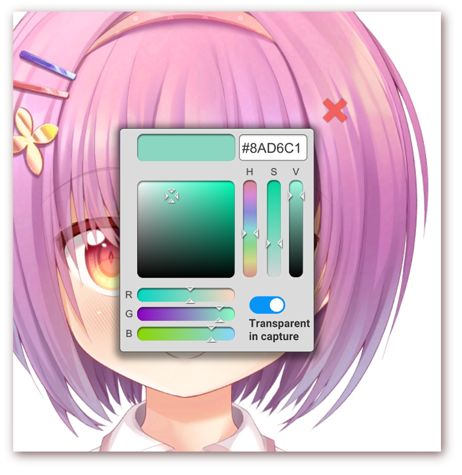
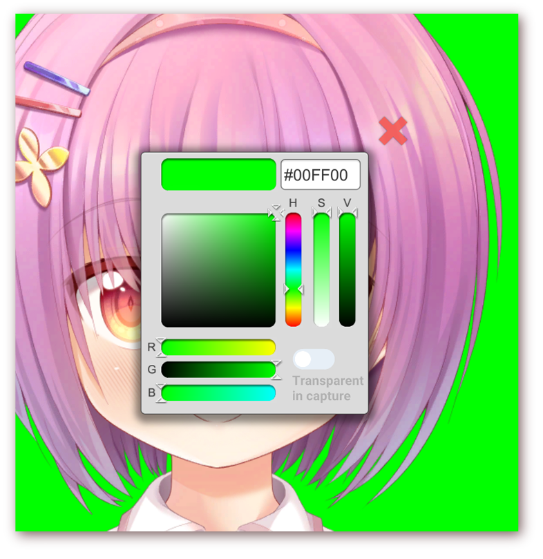
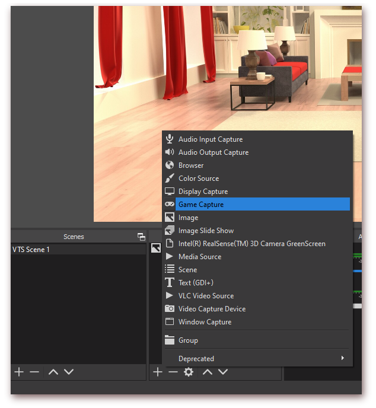
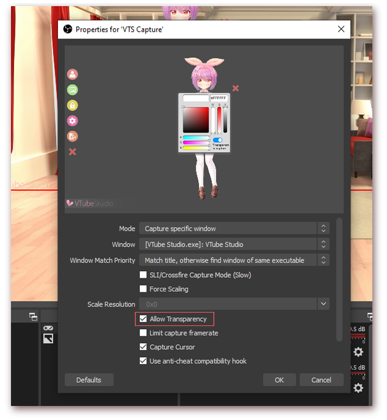
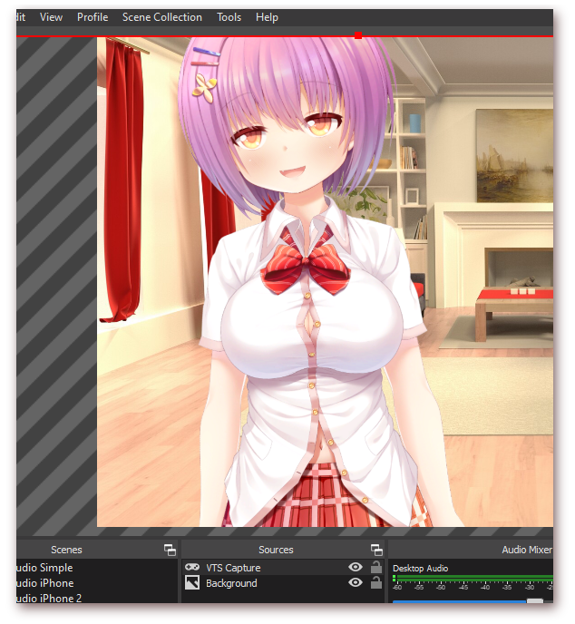

# How to use OBS to record or livestream using VTube Studio

[\[Back to main page\]](https://denchisoft.github.io/)

Any Windows/Mac recording software should work with VTube Studio. This is a short guide on how to set up OBS recording.

## 1. Prepare VTube Studio

Start VTube Studio on your PC or Mac and choose the __Color Picker__ background. On Windows, you can use the __"Transparent in capture"__ option here, which will make the window background transparent in OBS so you don't need to use a greenscreen.

__On macOS, this feature is not supported by OBS__, so choose any color you want here. You can remove that color from the video capture in OBS using a __"Chroma Key"__ filter. Keep in mind that you can't use that color in your Live2D model, otherwise some parts of your model may be transparent as well.

## 2. Prepare OBS

Add a background in OBS, then add a capture for VTube Studio. To do that, select __"Game Capture"__. This supports transparent backgrounds but is only available on Windows. On macOS, this option is called __"Syphon Client"__, but does not work after macOS 10.14 Mojave (see https://github.com/zakk4223/SyphonInject), so you need to use a regular window capture.

Choose application to capture ("Vtube Studio"). If you want to use a transparent background on windows, make sure the box for __"Allow Transparency"__ is checked.

Your capture is now active. On macOS, you need to add a filter to remove the green (or whatever color you selected) background using __Right Click your capture -> Filters -> Add Filter -> Chroma Key__

You can now place your character anywhere on screen by moving/scaling/rotating it in VTube Studio or in OBS.

For the OBS and greenscreen setup, you can also take a look at this video (starts at 33:20):

<iframe width="360" height="252" src="//www.youtube.com/embed/q5dKr0ulx10?t=2000" frameborder="0" allowfullscreen="allowfullscreen">&nbsp;</iframe>

