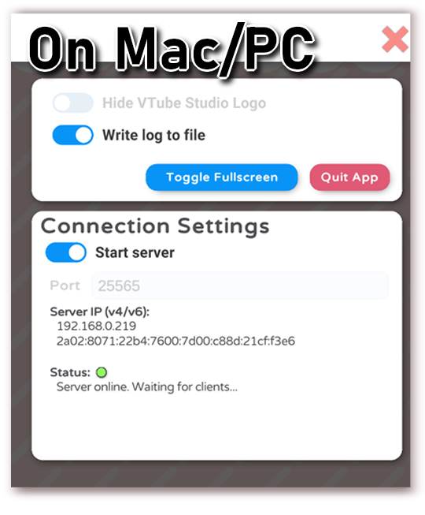
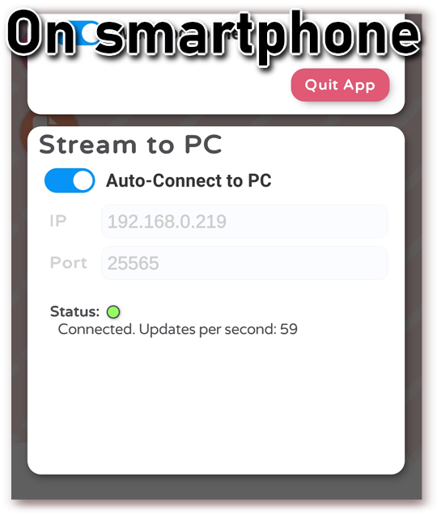
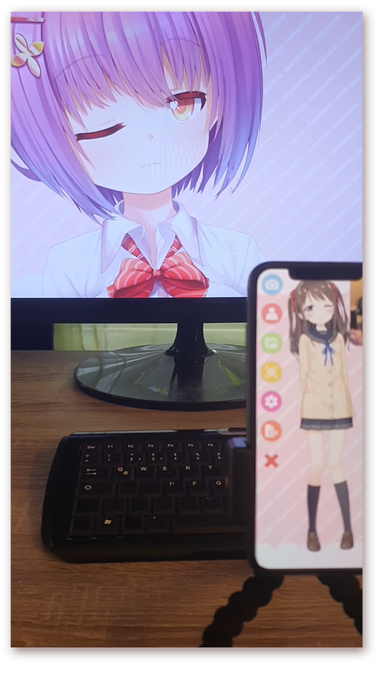

# How to stream from smartphone to PC/Mac

[\[Back to main page\]](https://denchisoft.github.io/)

Streaming the face tracking data from your smartphone to PC/Mac is easy. First, make sure both your smartphone and PC/Mac are on the same local network, otherwise they will not be able to see each other.

Then, start the desktop app. In the settings, you can activate the server after choosing a port (try leaving the default port first, 25565). 

Depending on your network, this will show two IPs, one __IPv4__ and one __IPv6__. They will both work, so note one down.

Next, start the app on your smartphone. In the settings, choose the __IP and port from the desktop application__. Click "Auto-Connect to PC". The app will now automatically connect to the server. If the connection is lost for some reason, the app will try to re-establish the connection automatically.

__Congratulations.__ You are now streaming your face tracking data to your PC. You can now open a VTS model in the desktop application and it will use the data from the smartphone. You can also have the same or a different model open in the smartphone app at the same time, if you'd like.

